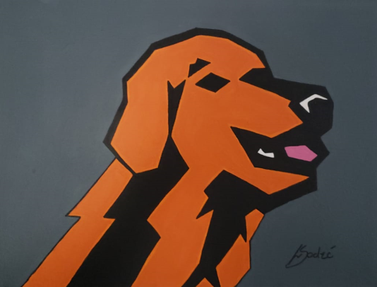
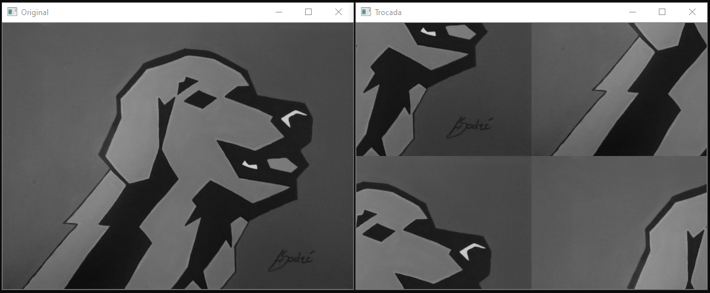

:source-highlighter: pygments
:numbered:
:author: Leonardo e Mauricio
:icons:
:experimental:
:stem:
:imagesdir: ./figuras
:toc: left
:doctype: book
:source-highlighter: pygments
:caution-caption: Cuidado
:important-caption: Importante
:note-caption: Nota
:tip-caption: Dica
:warning-caption: Aviso
:appendix-caption: Apêndice
:example-caption: Exemplo
:figure-caption: Figura
:listing-caption: Listagem
:table-caption: Tabela
:toc-title: Sumário
:preface-title: Prefácio
:version-label: Versão
:last-update-label: Última atualização

= Processamento Digital de Imagens (PDI) - Exercícios

== Introdução

O intuito deste site é mostrar as soluções dos exercícios propostos na disciplina de Processamento Digital de Imagens (DCA0445), ministrado pelo professor Agostinho Brito.

Todos os exercícios que serão apresentados foram desenvolvidos em C++ e com a biblioteca OpenCV utilizando o sistema operacional Windows 10. Para compilação foi utilizado o software Visual Studio 2019.

== Manipulando pixels em uma imagem

Para a realização dos exercícios ultilizamos do código exemplo pixels.cpp como referência e da figura golden.png para realização dos testes, o código pixels.cpp fui disponibilizado pelo professor e a imagem é de autoria.

=== Exercício Regiões

[source, cpp]
----
#include <opencv2/opencv.hpp>
#include <iostream>
using namespace cv;
using namespace std;

int main() {
   
    vector<String> endImg;
    Point ini, fim;
    vector<Point> pontos;
    //acessando a imagem original e transformando em preto e branco 
    glob("golden.png", endImg, false);
    Mat imagem = imread(endImg[0], CV_LOAD_IMAGE_GRAYSCALE);

    cout << "Digite a cordenada inicial de x entre 0 e " << imagem.size().width << endl;
    cin >> ini.x;
    cout << "Digite a cordenada final de x  entre 0 e " << imagem.size().width << endl;
    cin >> fim.x;
    cout << "Digite a cordenada inicial de y entre 0 e " << imagem.size().height << endl;
    cin >> ini.y;
    cout << "Digite a cordenada final de y entre 0 e " << imagem.size().height << endl;
    cin >> fim.y;
    
    //criando o quadrado para mostrar o negativo dessa regiao 
    for (int l = ini.x; l < fim.x; l++) {
        for (int c = ini.y; c < fim.y; c++) {
            imagem.at<uchar>(c, l) = 255 - imagem.at<uchar>(c, l);
        }
    }
    //mostrando o resultado
    imshow("Golden", imagem);
    waitKey();

    return 0;
}
----
//imagem depois da seleção do programa 
image::golden-regiões.png[title="Golden.png"]

=== Exercício Troca de regiões

[source, cpp]
----
#include <iostream>
#include <opencv2/opencv.hpp>

using namespace cv;
using namespace std;

int main(int, char**) {
    Mat imagem, imagemaux;
// acesso da imagem original e convertendo em tons de cinza
    imagem = imread("Golden.png", CV_LOAD_IMAGE_GRAYSCALE);
    if (!imagem.data)
        cout << "nao abriu " << endl;

    imagemaux = imread("Golden.png", CV_LOAD_IMAGE_GRAYSCALE);

    imshow("Original", imagem);

    for (int i = 0; i < (imagem.size().height) / 2; i++) { //1 quadrante
        for (int j = ((imagem.size().width) / 2); j < imagem.size().width; j++) {
            imagem.at<uchar>(i, j) = imagemaux.at<uchar>(i + (imagem.size().height) / 2, j - (imagem.size().width) / 2);
        }
    }

    for (int i = 0; i < (imagem.size().height) / 2; i++) { //2 quadrante 
        for (int j = 0; j < (imagem.size().width) / 2; j++) {
            imagem.at<uchar>(i, j) = imagemaux.at<uchar>(i + (imagem.size().height) / 2, j + (imagem.size().width) / 2);
        }
    }

    for (int i = (imagem.size().height) / 2; i < (imagem.size().height); i++) { //3 quadrante
        for (int j = 0; j < (imagem.size().width) / 2; j++) {
            imagem.at<uchar>(i, j) = imagemaux.at<uchar>(i - (imagem.size().height) / 2, j + (imagem.size().width) / 2);
        }
    }

    for (int i = (imagem.size().height) / 2; i < (imagem.size().height); i++) { //4 quadrante
        for (int j = ((imagem.size().width) / 2); j < imagem.size().width; j++) {
            imagem.at<uchar>(i, j) = imagemaux.at<uchar>(i - (imagem.size().height) / 2, j - (imagem.size().width) / 2);
        }
    }

    imshow("Trocada", imagem);
    waitKey();

    return 0;
}
----

== Serialização de dados em ponto flutuante via FileStorage

Para realizar este exercício utilizamos como base o  filestorage.cpp, código que foi disponibilizado pelo professor.

image::Saida do programa filestorege.png[title="Senoide gerada com 8 periodos"]

=== Exercício 

[source, cpp]
----
#include <iostream>
#include <opencv2/opencv.hpp>
#include <sstream>
#include <string>

int SIDE = 256;
int PERIODOS = 4;
float M_PI = 3.14159;
int amplitude = 127;

int main(int argc, char** argv) {
    std::stringstream ss_img, ss_yml;
    cv::Mat image;

    ss_yml << "senoide-" << SIDE << ".yml";
    image = cv::Mat::zeros(SIDE, SIDE, CV_32FC1);

    cv::FileStorage fs(ss_yml.str(), cv::FileStorage::WRITE);

    for (int i = 0; i < SIDE; i++) {
        for (int j = 0; j < SIDE; j++) {
            image.at<float>(i, j) = 127 * sin(2 * M_PI * PERIODOS * amplitude * j / SIDE) + 128;
        }
    }

    fs << "mat" << image;
    fs.release();

    cv::normalize(image, image, 0, 255, cv::NORM_MINMAX);
    image.convertTo(image, CV_8U);
    ss_img << "senoide-" << SIDE << ".png";
    cv::imwrite(ss_img.str(), image);

    fs.open(ss_yml.str(), cv::FileStorage::READ);
    fs["mat"] >> image;

    cv::normalize(image, image, 0, 255, cv::NORM_MINMAX);
    image.convertTo(image, CV_8U);

    cv::imshow("image", image);
    cv::waitKey();

    return 0;
}
----

image::senoide.png[title="Resultado do Filestorege"]

O exercício consistia em uma senoide com 4 periodos e uma aplitude de 127 desenhada na horizontal.

== Decomposição de imagens em planos de bits

Em construção...

== Preenchendo regiões

Uma das utilizações do processamento digital de imagens é contar e identificar objetos presentes na cena. Contamos os objetos nas imagens identificando aglomerados de pixels.
Para o funcionamento desse algoritmo rotulamos a imagem com um tom de cinza, com isso, analisamos onde existem aglomerados de pixel, assim rotulamos cada aglomerado desse com um tom de cinza diferente, no final contamos quantos aglomerados encontramos.

image::bolhas.png[title="Imagem a ser preenchida"]

[source, cpp]
----

#include <iostream>
#include <opencv2/opencv.hpp>

using namespace cv;

int main(int argc, char** argv) {
    cv::Mat image, realce;
    int width, height;
    int nobjects, comBolhas;

    cv::Point p;
    image = cv::imread("bolhas.png", cv::IMREAD_GRAYSCALE);

    if (!image.data) {
        std::cout << "imagem nao carregou corretamente\n";
        return(-1);
    }

    width = image.cols;
    height = image.rows;
    std::cout << width << "x" << height << std::endl;

    p.x = 0;
    p.y = 0;
    //  Percorrendo as Bordas
    //  Horizontais superior e inferior
    for (int i = 0; i < height; i = i + height - 1) {
        for (int j = 0; j < width; j++) {
            if (image.at<uchar>(i, j) == 255) {
                // achou um objeto
                p.x = j;
                p.y = i;
                floodFill(image, p, 0);
            }
        }
    }
    // Verticais direita e esquerda

    for (int i = 0; i < height; i++) {
        for (int j = 0; j < width; j = j + width - 1) {
            if (image.at<uchar>(i, j) == 255) {
                // achou um objeto
                p.x = j;
                p.y = i;
                floodFill(image, p, 0);
            }
        }
    }

    // busca objetos presentes
    nobjects = 0;
    for (int i = 0; i < height; i++) {
        for (int j = 0; j < width; j++) {
            if (image.at<uchar>(i, j) == 255) {
                // achou um objeto
                nobjects++;
                p.x = j;
                p.y = i;
                // preenche o objeto com o contador
                cv::floodFill(image, p, nobjects);
            }
        }
    }

    comBolhas = 0;
    p.x = 0;
    p.y = 0;
    floodFill(image, p, 255);
    for (int i = 1; i < height; i++) {
        for (int j = 1; j < width; j++) {
            if (image.at<uchar>(i - 1, j) > 0
                && image.at<uchar>(i - 1, j) < 255
                && image.at<uchar>(i, j) == 0) {
                //Identificação de um objeto
                comBolhas++;
                p.x = j;
                p.y = i;
                //Contador
                cv::floodFill(image, p, 255);
            }
        }
    }
    std::cout << "a figura tem " << nobjects << " objetos\n";
    std::cout << "a figura tem " << comBolhas << " objetos com bolhas internas\n";
    cv::imshow("image", image);
    cv::imwrite("labeling.png", image);
    cv::waitKey();
    return 0;
}
----

Resultado

image::contagem.png[title="Bolhas labeling"]

== Manipulação de histogramas

=== Equalizador
Este programa tem como finalidade equalizar o histograma de imagem capturadas por câmeras com iluminação variada.

[source, cpp]
----
#include <iostream>
#include <opencv2/opencv.hpp>

using namespace cv;
using namespace std;

int main(int argc, char** argv) {
    Mat imagem, imageeq;
    int width, height;
    VideoCapture cap;
    vector<Mat> planes, planeseq;
    Mat histR, histG, histB;
    int nbins = 64;
    float range[] = { 0, 256 };
    const float* histrange = { range };
    bool uniform = true;
    bool acummulate = false;

    cap.open(0);

    // verificação da entrada da camera se esta ou não conectada
    if (!cap.isOpened()) {
        cout << "cameras indisponiveis";
        return -1;
    }

    width = cap.get(CV_CAP_PROP_FRAME_WIDTH);
    height = cap.get(CV_CAP_PROP_FRAME_HEIGHT);

    // Retorna a altura e largura da imagem que ta sendo capturada
    cout << "largura = " << width << endl;
    cout << "altura  = " << height << endl;

    int histw = nbins, histh = nbins / 2;
    Mat histImgR(histh, histw, CV_8UC3, Scalar(0, 0, 0));
    Mat histImgG(histh, histw, CV_8UC3, Scalar(0, 0, 0));
    Mat histImgB(histh, histw, CV_8UC3, Scalar(0, 0, 0));

    while (1) {
        cap >> imagem;
        split(imagem, planes);
        split(imagem, planeseq);
        //EQUALIZACAO
        equalizeHist(planes[0], planeseq[0]);
        equalizeHist(planes[1], planeseq[1]);
        equalizeHist(planes[2], planeseq[2]);
        merge(planes, imagem);
        merge(planeseq, imageeq);
        // calculo da vermelha
        calcHist(&planes[0], 1, 0, Mat(), histR, 1,
            &nbins, &histrange,
            uniform, acummulate);
        // calculo da verde
        calcHist(&planes[1], 1, 0, Mat(), histG, 1,
            &nbins, &histrange,
            uniform, acummulate);
        // calculo da azul
        calcHist(&planes[2], 1, 0, Mat(), histB, 1,
            &nbins, &histrange,
            uniform, acummulate);

        normalize(histR, histR, 0, histImgR.rows, NORM_MINMAX, -1, Mat());
        normalize(histG, histG, 0, histImgG.rows, NORM_MINMAX, -1, Mat());
        normalize(histB, histB, 0, histImgB.rows, NORM_MINMAX, -1, Mat());

        histImgR.setTo(Scalar(0));
        histImgG.setTo(Scalar(0));
        histImgB.setTo(Scalar(0));

        for (int i = 0; i < nbins; i++) {
            line(histImgR,
                Point(i, histh),
                Point(i, histh - cvRound(histR.at<float>(i))),
                Scalar(0, 0, 255), 1, 8, 0);
            line(histImgG,
                Point(i, histh),
                Point(i, histh - cvRound(histG.at<float>(i))),
                Scalar(0, 255, 0), 1, 8, 0);
            line(histImgB,
                Point(i, histh),
                Point(i, histh - cvRound(histB.at<float>(i))),
                Scalar(255, 0, 0), 1, 8, 0);
        }
        histImgR.copyTo(imagem(Rect(0, 0, nbins, histh)));
        histImgG.copyTo(imagem(Rect(0, histh, nbins, histh)));
        histImgB.copyTo(imagem(Rect(0, 2 * histh, nbins, histh)));
        imshow("imagem", imagem);
        // Imagem equalizada
        // calculo da vermelha
        calcHist(&planeseq[0], 1, 0, Mat(), histR, 1,
            &nbins, &histrange,
            uniform, acummulate);
        // calculo da verde
        calcHist(&planeseq[1], 1, 0, Mat(), histG, 1,
            &nbins, &histrange,
            uniform, acummulate);
        // calculo da azul
        calcHist(&planeseq[2], 1, 0, Mat(), histB, 1,
            &nbins, &histrange,
            uniform, acummulate);

        normalize(histR, histR, 0, histImgR.rows, NORM_MINMAX, -1, Mat());
        normalize(histG, histG, 0, histImgG.rows, NORM_MINMAX, -1, Mat());
        normalize(histB, histB, 0, histImgB.rows, NORM_MINMAX, -1, Mat());

        histImgR.setTo(Scalar(0));
        histImgG.setTo(Scalar(0));
        histImgB.setTo(Scalar(0));

        for (int i = 0; i < nbins; i++) {
            line(histImgR,
                Point(i, histh),
                Point(i, histh - cvRound(histR.at<float>(i))),
                Scalar(0, 0, 255), 1, 8, 0);
            line(histImgG,
                Point(i, histh),
                Point(i, histh - cvRound(histG.at<float>(i))),
                Scalar(0, 255, 0), 1, 8, 0);
            line(histImgB,
                Point(i, histh),
                Point(i, histh - cvRound(histB.at<float>(i))),
                Scalar(255, 0, 0), 1, 8, 0);
        }
        histImgR.copyTo(imageeq(Rect(0, 0, nbins, histh)));
        histImgG.copyTo(imageeq(Rect(0, histh, nbins, histh)));
        histImgB.copyTo(imageeq(Rect(0, 2 * histh, nbins, histh)));
        imshow("imageeq", imageeq);
        if (waitKey(30) >= 0) break;
    }
    return 0;
}
----
imagem antes e depois da equalização, vemos uma certa melhora na qualidade e uma definição de cores mais acentuada.

image::kiki.png[title="Histograma"]

=== Detector de movimento 
Este código mostra a detecção de movimento

[source, cpp]
----
#include <iostream>
#include <opencv2/opencv.hpp>

using namespace cv;
using namespace std;

int main(int argc, char** argv) {
    Mat imagem;
    int width, height;
    VideoCapture cap;
    vector<Mat> planes;
    Mat histR, histG, histB;
    int nbins = 64;
    float range[] = { 0, 256 };
    const float* histrange = { range };
    bool uniform = true;
    bool acummulate = false;
    float dif;

    cap.open(0);

    // verificação da entrada da camera se esta ou não conectada
    if (!cap.isOpened()) {
        cout << "cameras indisponiveis";
        return -1;
    }

    width = cap.get(CV_CAP_PROP_FRAME_WIDTH);
    height = cap.get(CV_CAP_PROP_FRAME_HEIGHT);

    // Retorna a altura e largura da imagem que ta sendo capturada
    cout << "largura = " << width << endl;
    cout << "altura  = " << height << endl;

    int histw = nbins, histh = nbins / 2;
    Mat histImgR(histh, histw, CV_8UC3, Scalar(0, 0, 0));
    Mat histImgG(histh, histw, CV_8UC3, Scalar(0, 0, 0));
    Mat histImgB(histh, histw, CV_8UC3, Scalar(0, 0, 0));

    while (1) {
        cap >> imagem;
        split(imagem, planes);
        calcHist(&planes[0], 1, 0, Mat(), histR, 1,
            &nbins, &histrange,
            uniform, acummulate);
        cap >> imagem;
        split(imagem, planes);
        calcHist(&planes[0], 1, 0, Mat(), histG, 1,
            &nbins, &histrange,
            uniform, acummulate);
        dif = compareHist(histR, histG, CV_COMP_CORREL);
        //cout << "diferenca: " << dif << endl;
        if (dif <= 0.96) {
            putText(imagem, "MOVIMENTO DETECTADO", Point(width / 2 - 200, height / 2), FONT_HERSHEY_SIMPLEX, 1, Scalar(0, 0, 255), 2);
        }

        imshow("imagem", imagem);
        if (waitKey(30) >= 0) break;
    }
    return 0;
}
----

A imagem a seguir mostra a detecção de movimento, feita por meio da variação do histrograma.

image::detector.png[title="Histograma"]

== Filtragem no domínio espacial I

Em construção...

== Filtragem no domínio espacial II

Em construção...

= Parte II: Processamento de Imagens no Domínio da Frequência

== A Tranformada Discreta de Fourier

Em construção...

== Filtragem no Domínio da Frequência

Esse filtro tem como finalidade de corrigir imagens com iluminação irregular, nele podemos corrigir os parâmetros de gamma, contraste para que fique da melhor forma possível.

[source, cpp]
----
#include <iostream>
#include <opencv2/opencv.hpp>
#include <math.h>

using namespace cv;
using namespace std;

float MAX = 100.0;

//-------PARAMETROS DO FILTRO
float gammal = 0;
float max_gammal = 100;
int gammal_slider = 0;

int d0_slider = 0;
float max_d0 = 256;
float d0 = 0;

float gammah = 0;
float max_gammah = 100;
int gammah_slider = 0;

float c = 0;
float max_c = 100;
int c_slider = 0;
//-------

Mat image, imageDft, padded;

// valores ideais dos tamanhos da imagem
// para calculo da DFT
int dft_M, dft_N;

char TrackbarName[50];

// troca os quadrantes da imagem da DFT
void deslocaDFT(Mat& image) {
    Mat tmp, A, B, C, D;

    // se a imagem tiver tamanho impar, recorta a regiao para
    // evitar cópias de tamanho desigual
    image = image(Rect(0, 0, image.cols & -2, image.rows & -2));
    int cx = image.cols / 2;
    int cy = image.rows / 2;

    // reorganiza os quadrantes da transformada
    // A B   ->  D C
    // C D       B A
    A = image(Rect(0, 0, cx, cy));
    B = image(Rect(cx, 0, cx, cy));
    C = image(Rect(0, cy, cx, cy));
    D = image(Rect(cx, cy, cx, cy));

    // A <-> D
    A.copyTo(tmp);  D.copyTo(A);  tmp.copyTo(D);

    // C <-> B
    C.copyTo(tmp);  B.copyTo(C);  tmp.copyTo(B);
}

void applyFilter() {
    Mat filter = Mat(padded.size(), CV_32FC2, Scalar(0));
    Mat tmp = Mat(dft_M, dft_N, CV_32F);

    for (int i = 0; i < dft_M; i++) {
        for (int j = 0; j < dft_N; j++) {
            //calculo do filtro homomorfico
            float d2 = pow(i - dft_M / 2.0, 2) + pow(j - dft_N / 2.0, 2);
            float exp = -c * (d2 / pow(d0, 2));
            float valor = (gammah - gammal) * (1 - expf(exp)) + gammal;
            tmp.at<float>(i, j) = valor;
        }
    }

    Mat comps[] = { tmp, tmp };
    merge(comps, 2, filter);

    Mat dftClone = imageDft.clone();

    mulSpectrums(dftClone, filter, dftClone, 0);

    deslocaDFT(dftClone);

    idft(dftClone, dftClone);

    vector<Mat> planos;

    split(dftClone, planos);

    normalize(planos[0], planos[0], 0, 1, CV_MINMAX);

    imshow("Homomorfico", planos[0]);
    imshow("Original", image);
}

void on_trackbar_gammal(int, void*) {
    gammal = (float)gammal_slider;
    gammal = max_gammal * gammal / MAX;
    applyFilter();
}

void on_trackbar_d0(int, void*) {
    d0 = d0_slider * max_d0 / MAX;
    applyFilter();
}

void on_trackbar_gammah(int, void*) {
    gammah = gammah_slider * max_gammah / MAX;
    applyFilter();
}

void on_trackbar_c(int, void*) {
    c = c_slider * max_c / MAX;
    applyFilter();
}

int main(int argvc, char** argv) {
    image = imread("Golden.png", CV_LOAD_IMAGE_GRAYSCALE);

    // identifica os tamanhos otimos para
    // calculo do FFT
    dft_M = getOptimalDFTSize(image.rows);
    dft_N = getOptimalDFTSize(image.cols);

    // realiza o padding da imagem
    Mat_<float> zeros;
    copyMakeBorder(image, padded, 0,
        dft_M - image.rows, 0,
        dft_N - image.cols,
        BORDER_CONSTANT, Scalar::all(0));

    // parte imaginaria da matriz complexa (preenchida com zeros)
    zeros = Mat_<float>::zeros(padded.size());

    // prepara a matriz complexa para ser preenchida
    imageDft = Mat(padded.size(), CV_32FC2, Scalar(0));

    copyMakeBorder(image, padded, 0,
        dft_M - image.rows, 0,
        dft_N - image.cols,
        BORDER_CONSTANT, Scalar::all(0));

    Mat_<float> realInput = Mat_<float>(padded);

    // insere as duas componentes no array de matrizes
    vector<Mat> planos;
    planos.push_back(realInput);
    planos.push_back(zeros);

    // combina o array de matrizes em uma unica
    // componente complexa
    merge(planos, imageDft);

    // calcula o dft
    dft(imageDft, imageDft);
    deslocaDFT(imageDft);

    namedWindow("Homomorfico", 1);

    sprintf_s(TrackbarName, "Gamma High");
    createTrackbar(TrackbarName, "Homomorfico", &gammah_slider, MAX, on_trackbar_gammah);

    sprintf_s(TrackbarName, "Gamma Low");
    createTrackbar(TrackbarName, "Homomorfico", &gammal_slider, MAX, on_trackbar_gammal);

    sprintf_s(TrackbarName, "C");
    createTrackbar(TrackbarName, "Homomorfico", &c_slider, MAX, on_trackbar_c);

    sprintf_s(TrackbarName, "Cutoff D0");
    createTrackbar(TrackbarName, "Homomorfico", &d0_slider, MAX, on_trackbar_d0);

    applyFilter();
    waitKey(0);

    return 0;
}
----
image::original homo.png[title="Imagem original Homomórfico"]

Imagem com as configurações dos filtros para correção

image::filtro homomorfico.png[title="Imagem filtro Homomórfico"]

= Parte III: Segmentação de imagens

== Detecção de bordas com o algoritmo de Canny

Utilizando o algoritmo de Canny para detecção de bordas e o pontilhismo, conseguimos reproduzir a imagem abaixo de com a técnica pontilista. Tivemos como base o código pontilhismo.cpp para realizar essa atividade. A atividades consiste em utilizar o pontilhismo para gerar uma imagem e em seguida nessa imagem pontilista aplicar o filtro de Canny.

image::ikki.png[title="Imagem original"]

[source, cpp]
----
#include <algorithm>
#include <cstdlib>
#include <ctime>
#include <fstream>
#include <iomanip>
#include <iostream>
#include <numeric>
#include <opencv2/opencv.hpp>
#include <vector>

using namespace cv;
using namespace std;

#define STEP 5
#define JITTER 3
#define RAIO 3

int main(int argc, char** argv) {
    srand(time(0));

    Mat imagem, canny_imagem, pontilhismo_imagem;
    vector<int> y_range; vector<int> x_range;
    int x, y, cinza_value, width, height;

    imagem = imread("ikki.png", CV_LOAD_IMAGE_GRAYSCALE); // Imagem em tom de cinza!
    if (!imagem.data) {
        cout << "Erro na abertura da imagem." << endl;
        exit(0);
    }

    width = imagem.size().width; height = imagem.size().height;
    x_range.resize(height / STEP); y_range.resize(width / STEP);
    iota(x_range.begin(), x_range.end(), 0); iota(y_range.begin(), y_range.end(), 0);

    for (uint i = 0; i < x_range.size(); i++) {
        x_range[i] = x_range[i] * STEP + STEP / 2; y_range[i] = y_range[i] * STEP + STEP / 2;
    }

    imagem.copyTo(pontilhismo_imagem);
    random_shuffle(x_range.begin(), x_range.end());

    for (auto i : x_range) {
        random_shuffle(x_range.begin(), x_range.end());
        for (auto j : y_range) {
            x = i + rand() % (2 * JITTER) - JITTER + 1; y = j + rand() % (2 * JITTER) - JITTER + 1;
            cinza_value = imagem.at<uchar>(x, y);
            circle(pontilhismo_imagem, cv::Point(y, x), RAIO, CV_RGB(cinza_value, cinza_value, cinza_value), -1, CV_AA);
        }
    }
    imwrite("Pont1.png", pontilhismo_imagem);

    /*
      O código abaixo executa o filtro de canny na imagem "n_passo" vezes,
      e a cada passo aumenta os limiares do filtro, diminuindo o número de bordas da saída,
      e ao mesmo tempo melhorando a qualidade da imagem final.
    */
    int n_passo = 5;
    for (int i = 0; i < n_passo; i++) {

        /*
         * Raio = Raio do círculo desenhado
         * Low_limiar = Limiar inferior do filtro / high_limiar = Limiar superior do filtro
        */
        int raio = 5 - i, low_limiar = 10 * i, high_limiar = 3 * low_limiar;

        Canny(imagem, canny_imagem, low_limiar, high_limiar);

        for (int i = 0; i < height; i++) {
            for (int j = 0; j < width; j++) {
                if (canny_imagem.at<uchar>(i, j) > 0) {
                    cinza_value = imagem.at<uchar>(i, j);
                    circle(pontilhismo_imagem, cv::Point(j, i), raio, CV_RGB(cinza_value, cinza_value, cinza_value), -1, CV_AA);
                }
            }
        }
    }
    imwrite("Pont2.png", pontilhismo_imagem);
    return 0;
}
----
Imagem usando a técnica pontilista

image::Pont1.png[title="Pontilista"]

Imagem usando a técnica pontilista e o filtro de Canny

image::Pont2.png[title="Pontilista e Canny"]

== Quantização vetorial com k-means

K-means clustering é um método de quantização de vetores, neste método escolhe-se um centro ou uma determinada quantidades de centros, esses cetros são escolhidos para representar uma determinada classe, feito de maneira aleatória ou não, para se determinar a que classe pertence devesse ver a distância do ponto até o centro, com isso classificando a que classe pertence.

Programa onde a execução do código usa o parâmetro nRodadas=1 e inciar os centros de forma aleatória usando o parâmetro KMEANS_RANDOM_CENTERS. Realiza 10 rodadas diferentes do algoritmo.

Imagem usanda

image::ikki.png[title="Original"]

[source, cpp]
----
#include <opencv2/opencv.hpp>
#include <cstdlib>
#include <string>
#include <iostream>
using namespace std;
using namespace cv;

int main(int argc, char** argv) {
    int nClusters = 6;
    Mat rotulos;
    int nRodadas = 1;
    Mat centros;
    int cont = 1;

    Mat imagem = imread("ikki.png");
    if (!imagem.data)
        cout << "erro" << endl;

    Mat samples(imagem.rows * imagem.cols, 3, CV_32F);

    while (cont <= 10) {
        for (int y = 0; y < imagem.rows; y++) {
            for (int x = 0; x < imagem.cols; x++) {
                for (int z = 0; z < 3; z++) {
                    samples.at<float>(y + x * imagem.rows, z) = imagem.at<Vec3b>(y, x)[z];
                }
            }
        }

        kmeans(samples,
            nClusters,
            rotulos,
            TermCriteria(CV_TERMCRIT_ITER | CV_TERMCRIT_EPS, 10000, 0.0001),
            nRodadas,
            KMEANS_RANDOM_CENTERS,
            centros);

        Mat rotulada(imagem.size(), imagem.type());
        for (int y = 0; y < imagem.rows; y++) {
            for (int x = 0; x < imagem.cols; x++) {
                int indice = rotulos.at<int>(y + x * imagem.rows, 0);
                rotulada.at<Vec3b>(y, x)[0] = (uchar)centros.at<float>(indice, 0);
                rotulada.at<Vec3b>(y, x)[1] = (uchar)centros.at<float>(indice, 1);
                rotulada.at<Vec3b>(y, x)[2] = (uchar)centros.at<float>(indice, 2);
            }
        }
        stringstream ss;
        ss << "saida" << cont << ".png";
        string s = ss.str();
        cont++;

        imshow("K-means clustering imagem", rotulada);
        imwrite(s, rotulada);
        waitKey(1);
    }
    return 0;
}
----

Resultado após passar pelo K-means

image::Kmeans.gif[title="Pontilista"]

= Parte IV: Outras Transformadas Matemáticas

== Filtragem de forma com morfologia matemática

Em construção...

